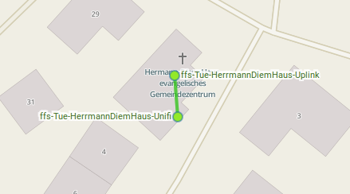

<<<<<<< HEAD
# Gemeindehaus Paul-Lechler-Straße = Herrmann Diem Haus

 * Der kleinste Telekom Internetanschluss ist seit 5'2016 für Freifunk eingerichtet.

 * Ein 1043er und eine Unifi decken das gesamte Gebäude ab.

## Setup
* [ffs-Tue-HerrmannDiemHaus-Uplink](ffs-Tue-HerrmannDiemHaus-Uplink.sh) Offloader
* [ffs-Tue-HerrmannDiemHaus-Unifi](ffs-Tue-HerrmannDiemHaus-Unifi.sh) AP
>>>>>>> f591955f31ef1557471818c5d61421edfb842d48
