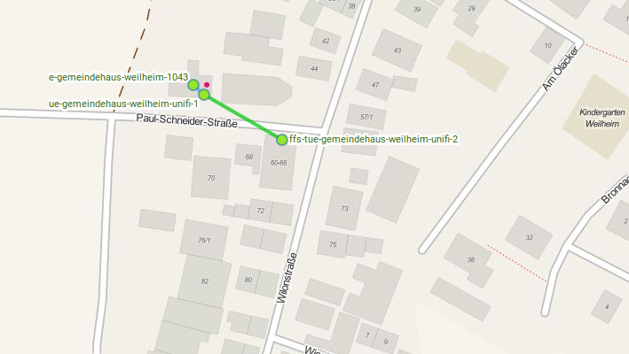

# Gemeindehaus Weilheim

## Information
Im kleinen Weilheimer Gemeindehaus und auf dem Vorplatz der Kirche soll Freifunk bereitgestellt werden. Der Internetanschluss ist im wenige Meter entfernten Pfarrhaus verfügbar. Das Setup funktioniert über einen Offloader und zwei Unifi AP LR, die zwischen den beiden Häusern meshen.

## Setup

* [ffs-tue-gemeindehaus-weilheim-1043](ffs-tue-gemeindehaus-weilheim-1043.sh) Ein 1043 als Offloader im Büro, direkt neben der fritzbox
* [ffs-tue-gemeindehaus-weilheim-unifi-1](ffs-tue-gemeindehaus-weilheim-unifi-1.sh) Unifi AP LR im Büro des Pfarrers, auf dem linken der drei Fenster waagrecht auf der Fensterbank liegend
* [ffs-tue-gemeindehaus-weilheim-unifi-2](ffs-tue-gemeindehaus-weilheim-unifi-2.sh) Unifi AP LR im Gemeindehaus mit MeshOnRadio im 1OG in der Decke des rechten Dachfensters festgeklebt.
* Nanostation loco M5 [weilheim-kirchturm-to-unterkunft](XW-44D9E7B4E079.cfg) Station mode 192.168.1.37

## Status
###11.05.2016
Geld ist bewilligt unter der Vorgabe keine Außengeräte anzubringen, die Geschwindigkeit zu beschränken und ein Abschalten nach Bedarf erfolgen kann.

Erster Plan aus dem Bauch heraus:

* 1OG Pfarrhaus: Ein 1043 Offloader am Internet und ein per Kabel verbundener Unifi AP LR
* EG Gemeindehaus: Ein Unifi AP LR der hoffentlich mit dem AP LR im Pfarrhaus mesht.

### 20.05.2016
Ein Test vor Ort hat ganz gut geklappt. Unifi-1 hatte nun doch zu beiden Knoten eine Mesh on Radio Verbindung und hatte da konstant etwas besser als -60 dB Empfangsstärke. Im zu versorgenden Raum des Gemeindehaus kamen laut Speedtest etwa 1.3 Mbit an, das dürfte aber am Gateway/VPN liegen. Youtube auf einem Gerät lief erstaunlich gut. In die Kirche reicht das Signal definitiv nicht, auf dem Vorplatz samt Sitzgelegenheit für Radfahrer klappte es aber gut.
Die Fritzbox im Gemeindehaus hat leider alle Eingänge belegt, deswegen bei der Installation unbedingt einen Switch/Hub mitbringen! Eventuell auch Schrauben, um Unifi-2 im Gemeindehaus zu befestigen.

### 08.06.2016
Florian und Justin haben die geplante Rouerkonstellation installiert. Unifi-2 scheint wieder offline zu sein, evtl hat da was am Kabel gewackelt.

### 02.09.2016
Stefan und Justin haben Weilheim Unterkunft und Weilheim Gemeindehaus mit Richtfunk verbunden.
