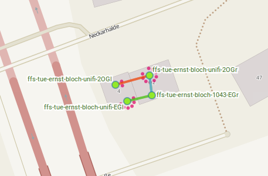

# Unterkunft Ernst-Bloch-Straße Tübingen

## Information
Die Unterkunft besteht aus einem Doppelhaus mit etwa 40 BewohnerInnen. Im Heizungskeller der rechten Hälfte (EG hinter der Treppe) steht ein Router von Unitiy Media. Im gesamten Haus sind zur Zeit drei Unifi AP und ein TP-Link 1043ND verbaut. Dabei ist ein Kabel durch das rechte Treppenhaus gezogen, der Rest erfolgt per MeshOnRadio.

## Setup
* [ffs-tue-ernst-bloch-1043-EGr](ffs-tue-ernst-bloch-1043-EGr.sh) Ein 1043 als Offloader im rechten EG Heizkeller.
* [ffs-tue-ernst-bloch-unifi-EGl](ffs-tue-ernst-bloch-unifi-EGl.sh) Unifi AP in der Waschküche EG links.
* [ffs-tue-ernst-bloch-unifi-2OGr](ffs-tue-ernst-bloch-unifi-2OGr.sh) Unifi AP im Treppenhaus 2OG. Mesht per Kabel mit 1043.
* [ffs-tue-ernst-bloch-unifi-2OGl](ffs-tue-ernst-bloch-unifi-2OGl.sh) Unifi AP im Gemeinschaftsraum 2OG.

## Status
### 11.05.2016
Geld ist bewilligt, Justin war noch nie da und schaut es sich am Freitag an.

### 13.05.2016
Justin war da, das Haus besteht aus drei Stockwerken und wird in der Mitte durch eine Wand unterteilt, hat also zwei Eingänge. Der Router von Unitymedia steht im rechten Haus EG in einem abgeschlossenen Heizungsraum unter der Treppe. Ich würde folgendes Setup vorschlagen:

* 1043 Offloader im Heizumgsraum EGrechts
* Unifi AP hinter der Dachluke im 2OGrechts, der über PoE und Kabel durchs Treppenhaus aus dem Heizungsraum im EGrechts versorgt wird. Das Kabel muss nicht länger als 30m sein.
* Unifi AP im Heizungsraum EGlinks, da gibt es auch Strom, Mesh on Wlan.
* Unifi AP im abschließbaren Gemeinschaftsraum 2OGlinks, Mesh on Wlan. 

Zur Montage also bitte folgendes mitbringen:
* 1x TP-LINK 1043ND
* 3x Unifi AP
* Die von Unitymedia für die Unterkunft gelieferte Box, die Justin noch abholt.
* Leiter für die Dachluke (besser was vor Ort orgnaisieren)
* Akkuschrauber und Schrauben um mindestens einen AP an der Wand zu befestigen
* Ein langes flaches Kabel für das Treppenhaus, sowie ein paar kleine für PoE.
* Klebeband

### 03.05.2016
Dierck, Tobias, Eva und Justin haben vier Geräte montiert. Erfahrungen fürs nächste Mal: Kabelbinder, Kabelnägel, Akkuschrauber immer dabei haben.

Der Empfang war schlechter als gedacht, die APs im linken Haus meshen überhaupt nicht miteinander. Mögliche Verbesserungen:
* Den Offloader nur als Offloader nehmen und noch einen AP in den Heizungsraum tun. Dann wird evtl die Wohnung rechts unten besser erreicht.
* Die Nodes ffs-tue-ernst-bloch-unifi-2OGl und ffs-tue-ernst-bloch-unifi-2OGr auf einen anderen Kanal stellen um die Airtime zu verbessern. 
* Offloader und 2OGr das gegenseitige MeshOnRadio verbieten, da die beiden bereits per Kabel meshen.

Falls alles ganz schlimm ist:
* Kabel zwischen EGl und 2OGl ziehen, so dass die auch MeshOnLAN machen.
